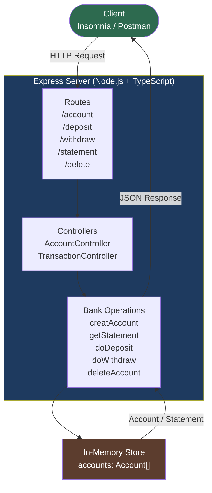

# Aplicacao Bancaria com Node.js + TypeScript | Banking App with Node.js + TypeScript

Este repositorio faz parte de um desafio pratico proposto pela **DIO (Digital Innovation One)**, com o objetivo de desenvolver uma aplicacao bancaria utilizando Node.js e TypeScript, aplicando os padroes REST no back-end.

This repository is part of a hands-on challenge proposed by **DIO (Digital Innovation One)**, aimed at building a banking application using Node.js and TypeScript, applying REST standards in the back-end.

---

## Fluxo da API | API Flow



---

## Objetivos do Projeto | Project Goals

**PT-BR**
- Consolidar conhecimentos de **Node.js** e **TypeScript**
- Compreender os fundamentos do desenvolvimento de APIs RESTful
- Simular funcionalidades reais de um sistema bancario (criacao de conta, depositos, saques e visualizacao de extrato)
- Aplicar boas praticas na estruturacao do codigo e organizacao de rotas

**EN**
- Strengthen knowledge of **Node.js** and **TypeScript**
- Understand the foundations of RESTful API development
- Simulate real banking system features (account creation, deposits, withdrawals and statement viewing)
- Apply best practices in code structure and route organization

---

## Funcionalidades | Features

| Operacao | Metodo | Rota | Description |
|----------|--------|------|-------------|
| Criar conta | `POST` | `/account` | Create bank account |
| Atualizar dados | `PUT` | `/account` | Update customer data |
| Consultar extrato | `GET` | `/statement` | Get account statement |
| Deposito | `POST` | `/deposit` | Make a deposit |
| Saque | `POST` | `/withdraw` | Make a withdrawal |
| Deletar conta | `DELETE` | `/account` | Delete account |

---

## Tecnologias | Tech Stack

- [Node.js](https://nodejs.org/)
- [TypeScript](https://www.typescriptlang.org/)
- [Express](https://expressjs.com/)
- [uuid](https://www.npmjs.com/package/uuid)
- [Nodemon](https://www.npmjs.com/package/nodemon)
- [Insomnia](https://insomnia.rest/) ou [Postman](https://www.postman.com/) para testes

---

## Estrutura do Projeto | Project Structure

```
src/
 ├── index.ts              # Entry point / Ponto de entrada
 ├── routes/               # API route definitions / Definicao de rotas
 ├── models/               # Data structures / Estrutura dos dados
 └── controllers/          # Business logic / Logica de cada operacao bancaria
```

---

## Como Executar | Getting Started

**PT-BR**

1. Clone o repositorio:
   ```bash
   git clone https://github.com/galafis/Construindo-Uma-App-Simples-de-Banco-Com-Typescript.git
   ```

2. Acesse a pasta do projeto:
   ```bash
   cd Construindo-Uma-App-Simples-de-Banco-Com-Typescript
   ```

3. Instale as dependencias:
   ```bash
   npm install
   ```

4. Inicie a aplicacao em modo de desenvolvimento:
   ```bash
   npm run dev
   ```

5. Use o **Insomnia** ou **Postman** para testar os endpoints da API.

**EN**

1. Clone the repository:
   ```bash
   git clone https://github.com/galafis/Construindo-Uma-App-Simples-de-Banco-Com-Typescript.git
   ```

2. Navigate to the project folder:
   ```bash
   cd Construindo-Uma-App-Simples-de-Banco-Com-Typescript
   ```

3. Install dependencies:
   ```bash
   npm install
   ```

4. Start the application in development mode:
   ```bash
   npm run dev
   ```

5. Use **Insomnia** or **Postman** to test the API endpoints.

---

## Exemplo de Uso | Usage Example

```bash
# Create an account / Criar uma conta
curl -X POST http://localhost:3000/account \
  -H "Content-Type: application/json" \
  -d '{"name": "Gabriel Lafis", "cpf": "12345678900"}'

# Make a deposit / Realizar deposito
curl -X POST http://localhost:3000/deposit \
  -H "Content-Type: application/json" \
  -H "cpf: 12345678900" \
  -d '{"amount": 500}'

# Get statement / Consultar extrato
curl -X GET http://localhost:3000/statement \
  -H "cpf: 12345678900"
```

---

## Observacoes | Notes

- Este projeto e didatico e nao utiliza banco de dados real. Todos os dados sao armazenados em memoria.
- This project is educational and does not use a real database. All data is stored in memory.
- Inspirado no repositorio base da DIO: [desafio01-ts](https://github.com/digitalinnovationone/desafio01-ts)

---

## Sobre o Autor | About the Author

**Gabriel Demetrios Lafis** — Cientista de Dados com interesse em desenvolvimento back-end moderno e APIs escaláveis.

[](https://github.com/galafis)

---

## Licenca | License

Este projeto esta sob a licenca MIT. Veja o arquivo [LICENSE](LICENSE) para mais detalhes.

This project is licensed under the MIT License. See the [LICENSE](LICENSE) file for details.
