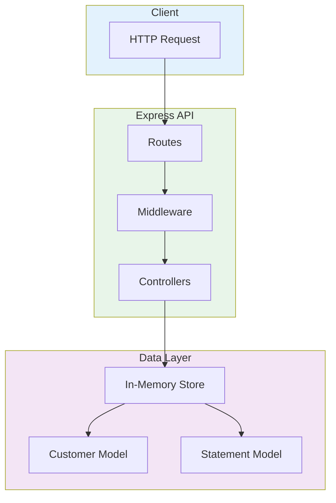

# Banking Application - Node.js + TypeScript

[](https://typescriptlang.org)
[](https://nodejs.org)
[](https://expressjs.com)
[](LICENSE)
[](Dockerfile)
[](Dockerfile)

[English](#english) | [Portugues (BR)](#portugues-br)

---

## English

### Overview

Simple banking application built with Node.js, Express, and TypeScript. Implements RESTful API endpoints for account management, deposits, withdrawals, and statement queries. Developed as part of a DIO (Digital Innovation One) bootcamp challenge focused on back-end development with TypeScript.

### Architecture


```mermaid
graph TB
    subgraph Client["Client"]
        A[HTTP Request]
    end

    subgraph API["Express API"]
        B[Routes]
        C[Middleware]
        D[Controllers]
    end

    subgraph Data["Data Layer"]
        E[In-Memory Store]
        F[Customer Model]
        G[Statement Model]
    end

    A --> B
    B --> C
    C --> D
    D --> E
    E --> F
    E --> G

    style Client fill:#e3f2fd
    style API fill:#e8f5e9
    style Data fill:#f3e5f5
```

### Key Features

- **Account Creation** -- Register new bank accounts with CPF and name validation
- **Duplicate Prevention** -- Automatic check for existing accounts before creation
- **Statement Management** -- Track credits and debits with timestamps and descriptions
- **RESTful Design** -- Clean REST API endpoints following HTTP standards
- **Type Safety** -- Full TypeScript interfaces for Customer and Statement models
- **UUID Generation** -- Unique identifiers for each account using uuid library

### Industry Application

This project demonstrates fundamental banking API patterns used in fintech applications, digital wallets, and payment platforms. The account management and transaction tracking concepts apply to neobank MVPs, credit union systems, and financial microservices architectures.

### Tech Stack

| Technology | Purpose |
|------------|---------|
| **TypeScript 5.0+** | Type-safe application logic |
| **Node.js 20+** | Runtime environment |
| **Express** | HTTP server framework |
| **uuid** | Unique ID generation |
| **Docker** | Containerized deployment |

### Quick Start

```bash
git clone https://github.com/galafis/Construindo-Uma-App-Simples-de-Banco-Com-Typescript.git
cd Construindo-Uma-App-Simples-de-Banco-Com-Typescript
npm install
npm start
```

### Docker

```bash
docker build -t banking-app-ts .
docker run -p 3333:3333 banking-app-ts
```

### API Endpoints

| Method | Route | Description |
|--------|-------|-------------|
| POST | /account | Create a new bank account |

### Project Structure

```
Construindo-Uma-App-Simples-de-Banco-Com-Typescript/
├── src/
│   └── index.ts
├── Dockerfile
├── package.json
├── tsconfig.json
└── LICENSE
```

### License

This project is licensed under the MIT License - see the [LICENSE](LICENSE) file for details.

### Author

**Gabriel Demetrios Lafis**
- GitHub: [@galafis](https://github.com/galafis)
- LinkedIn: [Gabriel Demetrios Lafis](https://linkedin.com/in/gabriel-demetrios-lafis)

---

## Portugues (BR)

### Visao Geral

Aplicacao bancaria simples construida com Node.js, Express e TypeScript. Implementa endpoints de API RESTful para gerenciamento de contas, depositos, saques e consultas de extrato. Desenvolvido como parte de um desafio do bootcamp DIO (Digital Innovation One) focado em desenvolvimento back-end com TypeScript.

### Principais Funcionalidades

- **Criacao de Conta** -- Registro de novas contas bancarias com validacao de CPF e nome
- **Prevencao de Duplicidade** -- Verificacao automatica de contas existentes antes da criacao
- **Gerenciamento de Extrato** -- Rastreamento de creditos e debitos com timestamps
- **Design RESTful** -- Endpoints de API REST limpos seguindo padroes HTTP
- **Seguranca de Tipos** -- Interfaces TypeScript completas para modelos Customer e Statement
- **Geracao de UUID** -- Identificadores unicos para cada conta usando biblioteca uuid

### Inicio Rapido

```bash
git clone https://github.com/galafis/Construindo-Uma-App-Simples-de-Banco-Com-Typescript.git
cd Construindo-Uma-App-Simples-de-Banco-Com-Typescript
npm install
npm start
```

### Licenca

Este projeto esta licenciado sob a Licenca MIT - veja o arquivo [LICENSE](LICENSE) para detalhes.

### Autor

**Gabriel Demetrios Lafis**
- GitHub: [@galafis](https://github.com/galafis)
- LinkedIn: [Gabriel Demetrios Lafis](https://linkedin.com/in/gabriel-demetrios-lafis)
